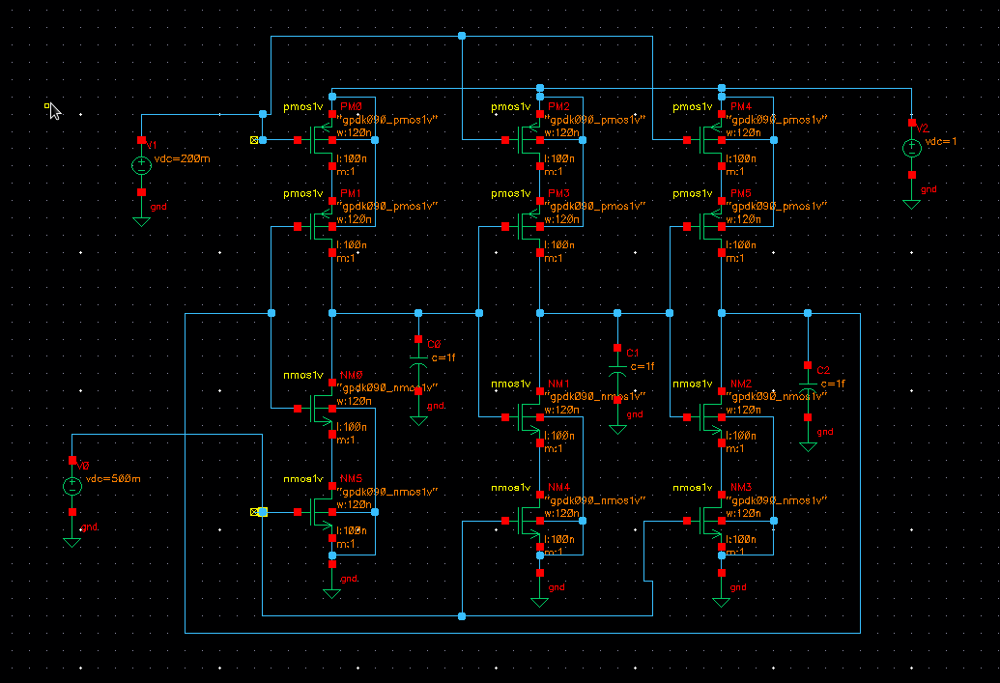
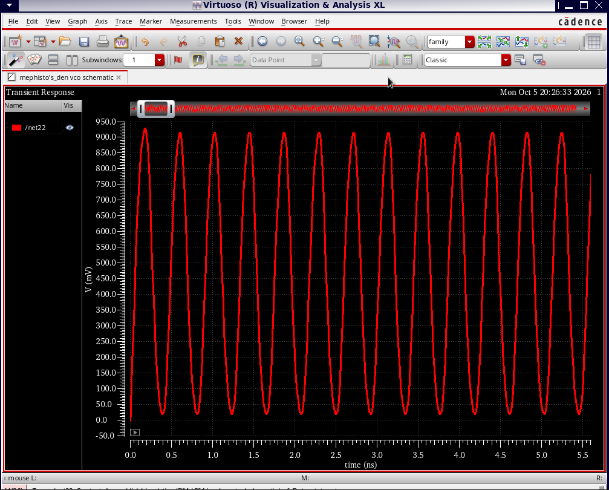
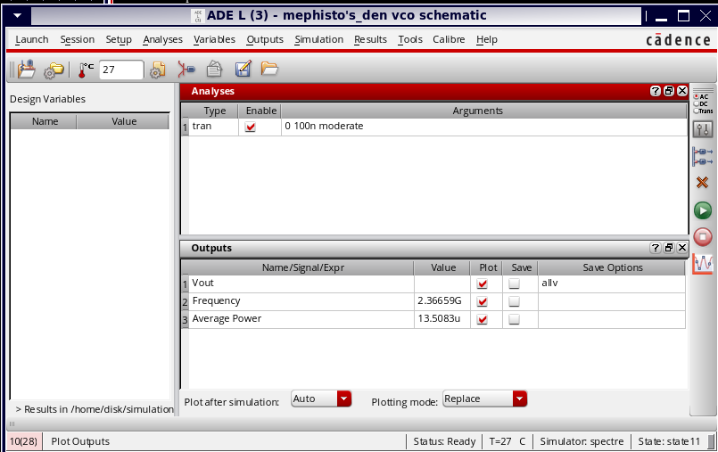

# 90-nm CMOS Voltage-Controlled Ring Oscillator

## Overview

Designed and simulated a **90-nm CMOS Voltage-Controlled Ring Oscillator (VCO)**
using **Cadence Virtuoso** and **Spectre**.

The VCO uses a multi-stage MOS inverter-based ring oscillator architecture,
with the oscillation frequency controlled through the applied bias voltage.

## Tools & Technology

- **Cadence Virtuoso**
- **Spectre Simulator**
- **90-nm GPDK**
- **CMOS MOSFETs**

## Circuit Schematic

The VCO was designed using a multi-stage MOS inverter-based architecture.

## Simulation Results

- **Supply Voltage:** 1 V
- **Oscillation Frequency:** 2.37 GHz
- **Average Power:** 13.5 µW
- **Analysis:** Transient
- **Technology:** 90-nm CMOS

### Transient Waveform

The transient simulation demonstrates stable periodic oscillation at the VCO output.

### Simulation Results

The Cadence ADE results show an oscillation frequency of approximately **2.37 GHz** and an average power consumption of approximately **13.5 µW**.

## Key Performance

| Parameter | Result |
|---|---:|
| Technology | 90-nm CMOS |
| Supply Voltage | 1 V |
| Oscillation Frequency | 2.37 GHz |
| Average Power | 13.5 µW |
| Simulation | Spectre Transient |

## Repository Contents

- `schematic.png` – VCO circuit schematic
- `waveform.png` – Transient simulation waveform
- `result.png` – Cadence ADE simulation results
- `README.md` – Project documentation

## Note

This project requires **Cadence Virtuoso/Spectre** and a compatible **90-nm CMOS PDK** for simulation. PDK/model files are not included due to licensing restrictions.
